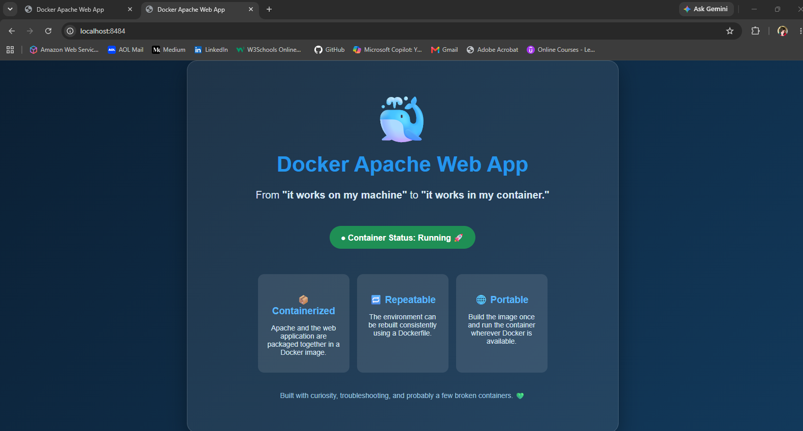
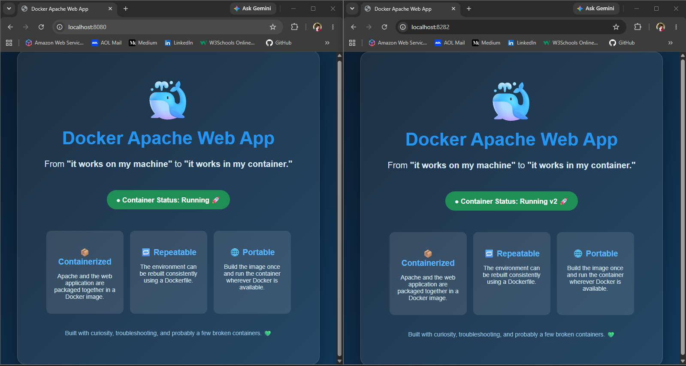
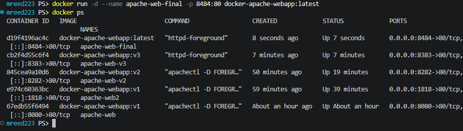
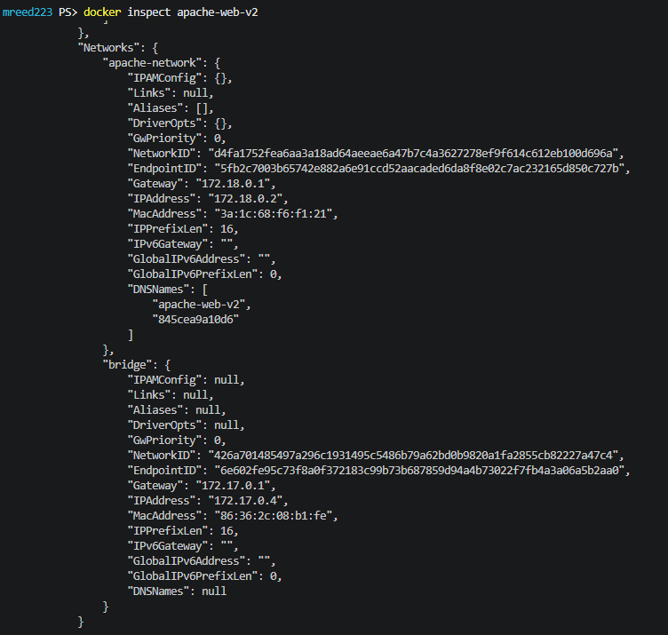
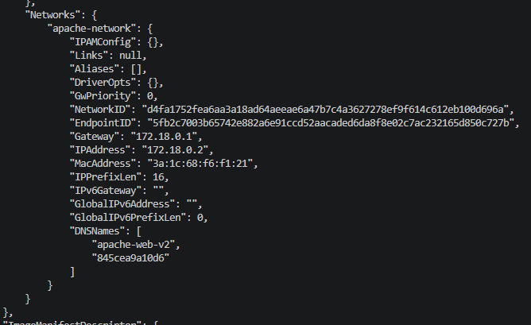
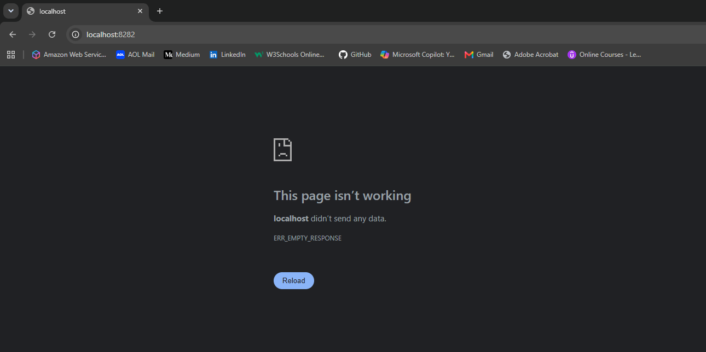
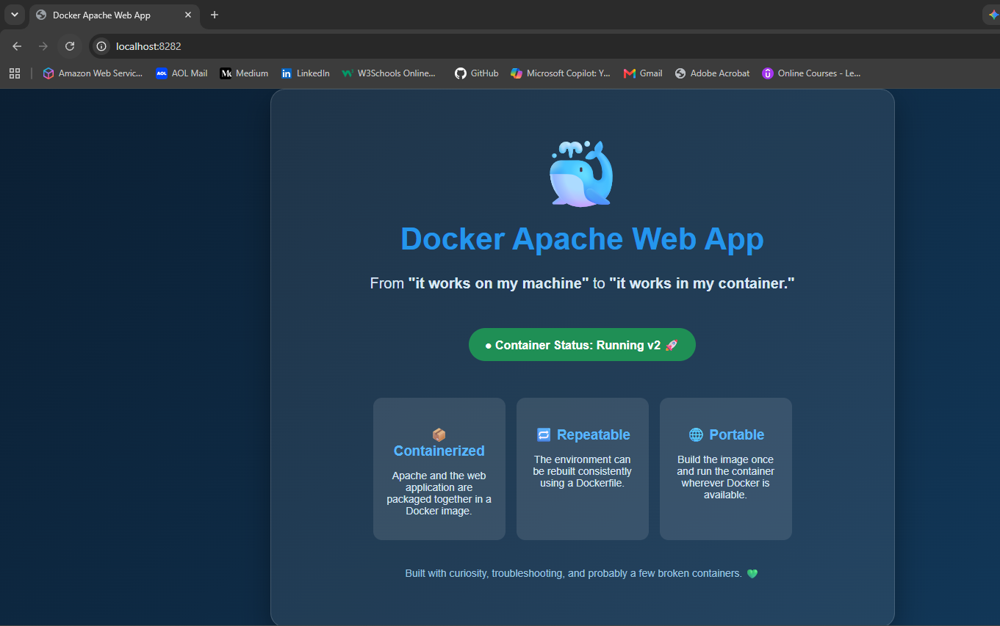
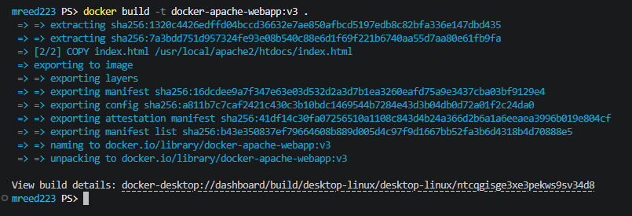
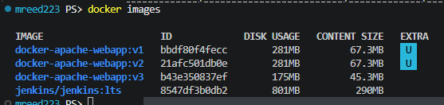
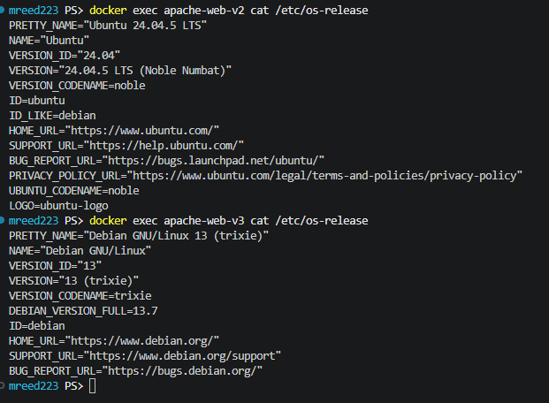

# 🐳 Docker Apache Web App

A hands-on Docker project that started as a simple Apache container and evolved into a deeper exploration of Docker images, containers, port mapping, networking, troubleshooting, image immutability, and Dockerfile optimization.

The goal wasn't just to get Apache running.

It was to understand **why it worked, what happened when it didn't, and how to build it better the next time.**

> From "it works on my machine" to "it works in my container."

---

## 📌 Project Overview

This project rebuilds and expands one of my earlier Docker labs.

The original version used an Ubuntu base image and installed Apache manually. For this rebuild, I kept that implementation for comparison and then refactored the application to use the official Apache HTTP Server image.

Along the way, I intentionally tested:

- Docker image builds
- Container creation and lifecycle
- Host-to-container port mapping
- Multiple containers from the same image
- Image and container immutability
- Docker layer caching
- Port conflicts
- Container name conflicts
- `docker inspect`
- User-defined bridge networks
- Container network attachment and removal
- Docker DNS behavior
- Troubleshooting a broken network path
- Base image selection
- Docker image optimization

The final application is a simple Apache-hosted webpage packaged inside a Docker image.

---

## 🏗️ Final Architecture

```text
Browser
   │
   │ http://localhost:8484
   ▼
Windows Host
   │
   │ Host Port 8484
   ▼
Docker Port Mapping
   │
   │ 8484 → 80
   ▼
Apache Container
   │
   │ Port 80
   ▼
Apache HTTP Server
   │
   ▼
index.html
   │
   ▼
🐳 Docker Apache Web App
```

---

## 📂 Repository Structure

```text
docker-apache-webapp/
│
├── screenshots/
│   ├── 01-v1-v2-immutability-side-by-side.png
│   ├── 02-image-size-comparison.png
│   ├── 03-container-on-two-networks.png
│   ├── 04-custom-network-only.png
│   ├── 05-network-change-browser-failure.png
│   ├── 06-network-restart-restored-app.png
│   ├── 07-ubuntu-vs-debian-base-images.png
│   ├── 08-multiple-container-port-mappings.png
│   ├── 09-final-web-app.png
│   └── 10-v3-httpd-build.png
│
├── .gitignore
├── Dockerfile
├── Dockerfile.ubuntu
├── index.html
└── README.md
```

---

# 🚀 Final Application

The finished application runs Apache using the official `httpd:2.4` Docker image.



The final container was tested using:

```bash
docker run -d \
  --name apache-web-final \
  -p 8484:80 \
  docker-apache-webapp:latest
```

The application was then available at:

```text
http://localhost:8484
```

---

# 🧱 Phase 1: Building Apache on Ubuntu

The first implementation used Ubuntu as the base image.

Instead of starting with Apache already installed, the Dockerfile was responsible for:

1. Starting with Ubuntu
2. Updating package information
3. Installing Apache
4. Copying the webpage into Apache's document root
5. Starting Apache in the foreground

I preserved this implementation as:

```text
Dockerfile.ubuntu
```

This version can still be built independently:

```bash
docker build \
  -f Dockerfile.ubuntu \
  -t docker-apache-webapp:ubuntu .
```

Keeping the original Dockerfile makes it possible to compare the first approach with the optimized final implementation.

---

# 🐳 Understanding Images vs. Containers

One of the most useful experiments in this project was testing Docker immutability.

I first built:

```text
docker-apache-webapp:v1
```

and started containers from that image.

I then changed the webpage to display:

```text
Container Status: Running v2 🚀
```

However, refreshing the existing v1 container still showed the original page.

That was expected.

Changing the local source code does **not** modify:

- An existing Docker image
- A container already created from that image

The workflow is:

```text
Source Code
     │
     │ docker build
     ▼
Docker Image
     │
     │ docker run
     ▼
Container
```

Changing the source only changes the source.

A new image must be built before Docker can create a container containing the new version.

I built:

```bash
docker build -t docker-apache-webapp:v2 .
```

and then created a new container from v2.

The two containers could run simultaneously while serving different versions of the same application.



This made Docker image immutability much easier to visualize.

---

# 🔌 Port Mapping

Apache listens on port `80` inside the container.

Docker's `-p` option maps a port on the host machine to that internal container port.

For example:

```bash
docker run -d \
  --name apache-web \
  -p 8080:80 \
  docker-apache-webapp:v1
```

The format is:

```text
HOST:CONTAINER
```

Therefore:

```text
8080:80
```

means:

```text
localhost:8080
       │
       ▼
Host Port 8080
       │
       ▼
Container Port 80
       │
       ▼
Apache
```

Multiple containers can listen on port `80` internally because each container has its own network namespace.

The host ports, however, must be unique.

During testing I ran several containers simultaneously using different host ports.



Examples included:

```text
8080 → 80
1818 → 80
8282 → 80
8383 → 80
8484 → 80
```

---

# 💥 Intentional Port Conflict

To test Docker's behavior when a host port is already occupied, I intentionally attempted to start another container using host port `8080`.

Docker returned:

```text
Bind for 0.0.0.0:8080 failed: port is already allocated
```

Running:

```bash
docker ps
```

did not show the failed container because it wasn't running.

However:

```bash
docker ps -a
```

revealed that Docker had successfully **created** the container before failing to start it.

Its state was:

```text
Created
```

This demonstrated an important distinction:

```text
docker run
   │
   ├── create container
   │
   └── start container
```

Container creation can succeed even if startup fails.

The failed container was removed with:

```bash
docker rm apache-conflict
```

---

# 🏷️ Container Name Conflicts

Docker container names must also be unique.

Even if a container is stopped, its name remains reserved until that container is removed.

For example, if this container already exists:

```text
apache-web
```

another container cannot be created using:

```bash
--name apache-web
```

Changing the port does not solve a container-name conflict.

This reinforced the difference between:

```text
Port conflict → host port already in use

Name conflict → container name already exists
```

---

# 🔄 Container Lifecycle

The project also included testing the difference between stopping, starting, and removing containers.

Stopping a container:

```bash
docker stop apache-web2
```

removes it from:

```bash
docker ps
```

but it remains visible with:

```bash
docker ps -a
```

because the container still exists.

The same container can then be restarted with:

```bash
docker start apache-web2
```

There is no need to provide the image, port mapping, or container name again.

Those settings belong to the existing container.

The lifecycle can be visualized as:

```text
docker run
    │
    ▼
CREATE + START
    │
    ▼
RUNNING
    │
    │ docker stop
    ▼
STOPPED
    │
    │ docker start
    ▼
RUNNING
    │
    │ docker rm
    ▼
REMOVED
```

---

# 🔎 Inspecting a Container

`docker inspect` was used to examine the actual configuration of running containers.

```bash
docker inspect apache-web-v2
```

This allowed me to verify:

- Container networking
- Internal IP addresses
- Docker gateways
- Image configuration
- Published ports
- Network attachments

For example, the container's published port configuration showed that:

```text
Container Port 80
        │
        ▼
Host Port 8282
```

This is useful during troubleshooting because it verifies what Docker is actually configured to do instead of relying on assumptions.

---

# 🌐 Docker Networking

Docker initially connected the containers to its default:

```text
bridge
```

network.

The available networks were viewed using:

```bash
docker network ls
```

To practice user-defined networking, I created:

```bash
docker network create apache-network
```

The running container was then attached to it:

```bash
docker network connect apache-network apache-web-v2
```

At this point the container was connected to both:

```text
bridge
```

and:

```text
apache-network
```



Docker assigned a separate IP address for each network.

The user-defined network also provided Docker DNS information for the container name.

That allows containers on the same user-defined network to communicate using names instead of depending on changing container IP addresses.

Conceptually:

```text
Application Container
        │
        │ container name
        ▼
Docker DNS
        │
        ▼
Other Container
```

This becomes especially useful in multi-container applications such as a web application communicating with a database.

---

# ✂️ Removing the Default Bridge

After verifying both network connections, I disconnected the container from Docker's default bridge:

```bash
docker network disconnect bridge apache-web-v2
```

Inspection then showed only:

```text
apache-network
```



The container had an internal address on the new network similar to:

```text
172.18.0.2
```

with the network gateway:

```text
172.18.0.1
```

---

# 🔥 Unexpected Networking Troubleshooting

This project produced an unplanned troubleshooting exercise.

After dynamically disconnecting the running container from the default bridge network, the application stopped responding through:

```text
localhost:8282
```



Instead of immediately changing the configuration back, I investigated the problem.

### Step 1: Verify the container

```bash
docker ps
```

Result:

```text
Container running ✅
```

### Step 2: Verify the published port

```bash
docker port apache-web-v2
```

Docker still reported:

```text
80/tcp → 0.0.0.0:8282
80/tcp → [::]:8282
```

Result:

```text
Port mapping configured ✅
```

### Step 3: Check Apache processes

I entered the running container with:

```bash
docker exec apache-web-v2 ps aux
```

Apache processes were running.

Result:

```text
Apache running ✅
```

### Step 4: Review logs

```bash
docker logs apache-web-v2
```

There was no fatal Apache error explaining the failed browser connection.

At this point the evidence showed:

```text
Container running          ✅
Apache running             ✅
Custom network attached    ✅
Port mapping configured    ✅
Browser connection         ❌
```

### Step 5: Restart the container

Rather than rebuilding or reconnecting the old network, I restarted the existing container:

```bash
docker restart apache-web-v2
```

After the restart:

```text
localhost:8282
```

worked again.



This was one of the most valuable parts of the project because the troubleshooting followed a path:

```text
Observe
   ↓
Verify container state
   ↓
Verify port configuration
   ↓
Verify application process
   ↓
Review logs
   ↓
Make one controlled change
   ↓
Retest
```

Instead of:

```text
Something broke
   ↓
Change everything
   ↓
Hope
```

---

# 🧰 Minimal Containers and Troubleshooting Tools

During troubleshooting I attempted:

```bash
docker exec apache-web-v2 curl http://localhost
```

The command failed because `curl` was not installed inside the image.

That reinforced another Docker concept:

> A container only contains the software and utilities provided by its image.

A troubleshooting utility that exists on the host machine is not automatically available inside a container.

This is especially important when working with minimal production container images.

---

# ⚡ Docker Layer Caching

When v2 was built after changing only `index.html`, Docker reused the unchanged layers from the previous build.

The Apache installation layer was cached while the `COPY` layer containing the changed webpage was rebuilt.

Conceptually:

```text
Base image                     CACHED
      ↓
Install Apache                 CACHED
      ↓
COPY changed index.html        REBUILT
```

This demonstrated why Dockerfile ordering matters.

Stable and expensive build steps can often be cached while frequently changing application files are copied later in the Dockerfile.

---

# 🛠️ Refactoring the Dockerfile

After proving the Ubuntu-based implementation worked, I looked at whether Ubuntu was really the best base image for this application.

The Ubuntu image required the project to:

```text
Start with Ubuntu
      ↓
Update package lists
      ↓
Install Apache
      ↓
Configure Apache startup
      ↓
Copy website
```

But this container has one job:

> Run Apache and serve the webpage.

Instead of building an Apache environment manually, I refactored the Dockerfile to use the official Apache HTTP Server image.

The final Dockerfile became:

```dockerfile
FROM httpd:2.4

COPY index.html /usr/local/apache2/htdocs/index.html

EXPOSE 80
```

Now the build process is essentially:

```text
Official Apache Image
        ↓
Copy Website
        ↓
Run
```



---

# 📉 Image Optimization

The change in base image produced a noticeable reduction in image size.

The Ubuntu-based versions used:

```text
v1 → 281 MB
v2 → 281 MB
```

The refactored Apache image used:

```text
v3 → 175 MB
```



That is a reduction of:

```text
106 MB
```

or approximately:

```text
38%
```

while providing the same application functionality.

This demonstrated that base-image selection can directly affect:

- Image size
- Build complexity
- Number of Dockerfile instructions
- Package-management responsibility
- Container maintainability

---

# 🐧 Comparing the Base Environments

I also inspected the operating-system environment inside both implementations.

For the Ubuntu-based v2 container:

```bash
docker exec apache-web-v2 cat /etc/os-release
```

returned Ubuntu 24.04 LTS.

For the optimized v3 container:

```bash
docker exec apache-web-v3 cat /etc/os-release
```

returned Debian GNU/Linux 13.



This demonstrated that the `FROM` instruction does more than determine what application is available.

It establishes the environment the container inherits.

### Ubuntu implementation

```text
Ubuntu
   ↓
Install Apache
   ↓
Our Dockerfile
   ↓
Website
```

### Official Apache implementation

```text
Debian-based environment
   ↓
Official httpd image
   ↓
Apache already configured
   ↓
Our Dockerfile
   ↓
Website
```

---

# 🐳 Building the Final Image

Build the optimized image:

```bash
docker build -t docker-apache-webapp:latest .
```

Verify it exists:

```bash
docker images
```

---

# ▶️ Running the Final Application

Create the container:

```bash
docker run -d \
  --name apache-web-final \
  -p 8484:80 \
  docker-apache-webapp:latest
```

Verify that it is running:

```bash
docker ps
```

Open:

```text
http://localhost:8484
```

The Docker Apache Web App should appear.

---

# 🔍 Useful Docker Commands Practiced

### Build an image

```bash
docker build -t docker-apache-webapp:latest .
```

### Run a container

```bash
docker run -d --name apache-web-final -p 8484:80 docker-apache-webapp:latest
```

### View running containers

```bash
docker ps
```

### View all containers

```bash
docker ps -a
```

### Stop a container

```bash
docker stop apache-web-final
```

### Start an existing container

```bash
docker start apache-web-final
```

### Restart a container

```bash
docker restart apache-web-final
```

### Remove a container

```bash
docker rm apache-web-final
```

### View images

```bash
docker images
```

### Inspect a container

```bash
docker inspect apache-web-final
```

### View published ports

```bash
docker port apache-web-final
```

### View container logs

```bash
docker logs apache-web-final
```

### Run a command inside a container

```bash
docker exec apache-web-final cat /etc/os-release
```

### View Docker networks

```bash
docker network ls
```

### Create a user-defined network

```bash
docker network create apache-network
```

### Connect a container to a network

```bash
docker network connect apache-network apache-web-final
```

### Inspect a network

```bash
docker network inspect apache-network
```

### Disconnect a container from a network

```bash
docker network disconnect bridge apache-web-final
```

---

# 💡 Key Lessons

### 1. Source code, images, and containers are different objects

```text
Source
  ↓ build
Image
  ↓ run
Container
```

Changing the source does not automatically change an existing image or container.

### 2. Port mappings are host-to-container mappings

```text
-p 8080:80
```

means:

```text
Host 8080 → Container 80
```

### 3. Multiple containers can use the same internal port

Several Apache containers can all listen on port `80`.

They simply need different host ports when published to the same host.

### 4. Stopped does not mean deleted

A stopped container still exists and retains its configuration.

### 5. Container names must be unique

Changing the host port does not resolve a duplicate container-name conflict.

### 6. `docker ps -a` can reveal things `docker ps` cannot

Failed or stopped containers may still exist even though they are not currently running.

### 7. User-defined networks provide better container-to-container networking

Containers on a user-defined bridge network can use Docker-provided name resolution.

### 8. Inspect before changing

Commands such as:

```text
docker inspect
docker port
docker logs
docker ps
```

help establish the current state before making troubleshooting changes.

### 9. Containers do not automatically include troubleshooting utilities

Tools such as `curl` must actually exist in the image before they can be executed inside the container.

### 10. The base image matters

Choosing a purpose-built image can simplify the Dockerfile and reduce image size.

---

# 🎯 Skills Practiced

- Docker
- Dockerfiles
- Apache HTTP Server
- Container lifecycle management
- Docker image creation
- Image tagging
- Image immutability
- Docker layer caching
- Port mapping
- Docker bridge networking
- User-defined Docker networks
- Container DNS
- Container inspection
- Container logs
- Linux process inspection
- Base image selection
- Image optimization
- Troubleshooting
- Git and GitHub
- Technical documentation

---

# 🧠 Why I Rebuilt This Project

This project originally taught me how to get Apache running inside Docker.

Rebuilding it later gave me the opportunity to ask better questions:

- What exactly is Docker building?
- What is the difference between an image and a container?
- Why doesn't changing a file change a running container?
- What happens when two containers want the same host port?
- What happens to a container when startup fails?
- How does Docker networking actually work?
- How can I verify the configuration instead of assuming it?
- What happens when networking changes while a container is running?
- Do I really need Ubuntu just to run Apache?
- Can I make the image simpler and smaller?

The biggest improvement wasn't just going from a 281 MB image to a 175 MB image.

It was moving from:

> "The container works."

to:

> **"I understand why it works, I can investigate when it doesn't, and I can explain how I improved it."**

That is the part of the rebuild that mattered most.

---

## 💚 Final Result

The project finished with:

```text
Purpose-built Apache base image
        +
Custom web application
        +
Repeatable Docker build
        +
Documented troubleshooting
        +
Networking practice
        +
Image optimization
        =
🐳 A much better Docker project
```

Built with curiosity, troubleshooting, and probably a few broken containers. 💚